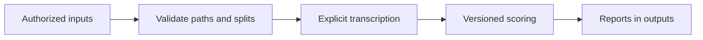
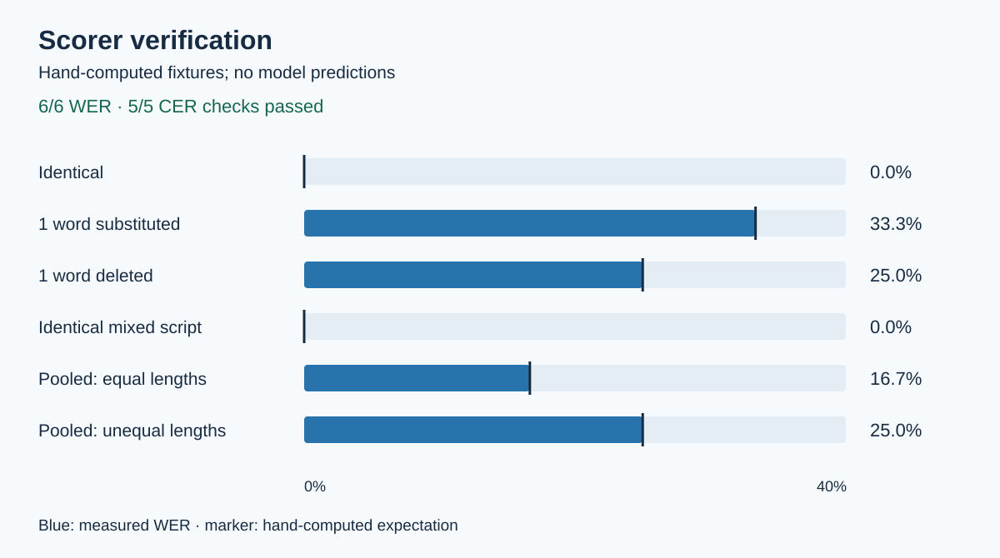

# Shono (শোনো)

Bengali speech transcription and evaluation.

**Python 3.11 · 4 notebooks · 11 scorer checks**

## Overview

| Component | Evidence |
| :--- | :--- |
| WER / CER | Hand-computed fixtures verified |
| Model accuracy | Unmeasured; no project-trained checkpoint |
| Cloud | Optional; disabled by default |

## Data flow



## Verification



[Values](outputs/scorer-check.csv) · [Source](outputs/scorer-check.toml)

```sh
git clone https://github.com/urmeo/shono
cd shono
./verify
```

Requires [uv](https://docs.astral.sh/uv/). [Data, runtime and scoring protocol](docs/PROTOCOL.md)

## Limits

- GPU training and provider inference unrun.
- Missing aligned data or unresolved permissions block execution.
- Speaker labels are coarse; word alignment is unverified.

## Tech stack

| Layer | Tools |
| :--- | :--- |
| Scoring | Python · jiwer · bnunicodenormalizer |
| Optional inference | Transformers · faster-whisper · Silero · pyannote |
| Reports | SVG · Markdown |

## References

[Whisper](https://arxiv.org/abs/2212.04356) · [Bengali-Loop](https://arxiv.org/html/2602.14291v1) · [MUCS](https://www.openslr.org/104/) · [Base checkpoint](https://huggingface.co/bengaliAI/tugstugi_bengaliai-asr_whisper-medium)

**Keywords:** speech · timestamps · scoring · provenance

[MIT code](LICENSE) · [Separate source terms](data/LICENSES.md)
