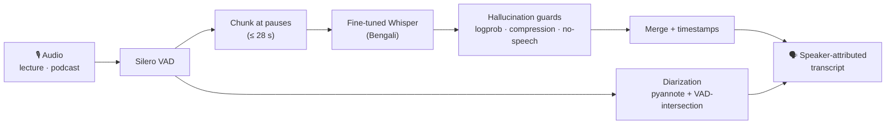
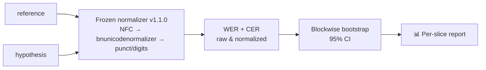
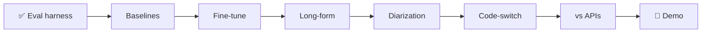

# Shono (শোনো) — Bengali ASR that survives the real world

Bengali speech recognition built for audio people actually record — not clean, read-aloud clips.

- **Long-form** — lectures and podcasts: chunked at natural pauses, transcribed, merged, timestamped
- **Diarization** — who spoke, not just what was said
- **Code-switching** — Bangla-English, the way people actually talk
- **Honest evaluation** — WER *and* CER, per slice, with confidence intervals, against the base model and commercial APIs

> **Status — foundation.** The full pipeline and evaluation harness are built and tested (167 tests, one `./verify`). **No model is fine-tuned yet, so no accuracy numbers are claimed.** When they appear, they ship with the exact scoring script, config, and confidence intervals that produced them — never a guess.

## Pipeline



Every number passes one frozen gate:



## Why the scorer came first

Bengali WER is easy to fake by accident: the ecosystem's most common normalizer (Whisper's default) strips vowel signs — কি becomes ক — hiding errors and *inflating* apparent accuracy. Shono freezes one documented, version-stamped normalizer and never uses Whisper's. Cross-script code-switch matches are never fabricated, and any number not yet measured renders `—`, never an assumed value. That discipline is enforced by tests, not good intentions.

## Quickstart

Requires [uv](https://docs.astral.sh/uv/); Python 3.11 resolves automatically.

```bash
git clone https://github.com/urmeo/shono && cd shono
./verify        # install + lint + full test suite (167 tests)
```

```python
from shono.eval import score, blockwise_bootstrap_ci

report = score(references, hypotheses)          # raw + normalized WER/CER
ci = blockwise_bootstrap_ci(records)            # records = (recording_id, ref, hyp)
print(f"WER {ci.point:.1%} [{ci.lower:.1%}, {ci.upper:.1%}]")
```

## Layout

```
src/shono/
  eval/        frozen normalization · WER/CER · bootstrap CI · report + CLI
  data/        manifests · license registry · train/test leakage audit
  train/       Whisper fine-tune recipe · checkpoint-resume · experiment record
  transcribe/  VAD chunking · hallucination guards · merge · CT2 convert
  diarize/     DER (collar/overlap) · pyannote + VAD-intersection · attribution
  api/         commercial-API adapters (Chirp, Deepgram) · $0 budget guard
  demo/        Gradio app · model-card generator
data/          dataset manifests + licenses — never audio
notebooks/     Kaggle training / benchmark notebooks (resumable)
reports/       eval report specs + generated reports
```

## Roadmap



Every stage's software is built and tested today; each fills with real, CI-backed numbers once the model is trained on a GPU.

## License

Code: [MIT](LICENSE). Datasets and model weights carry their own licenses, recorded per source in [`data/`](data/).
