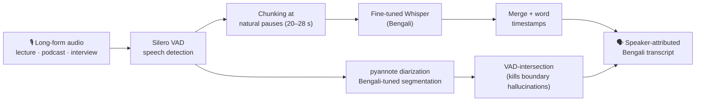
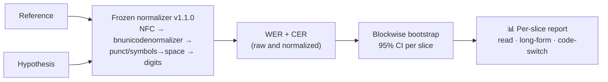
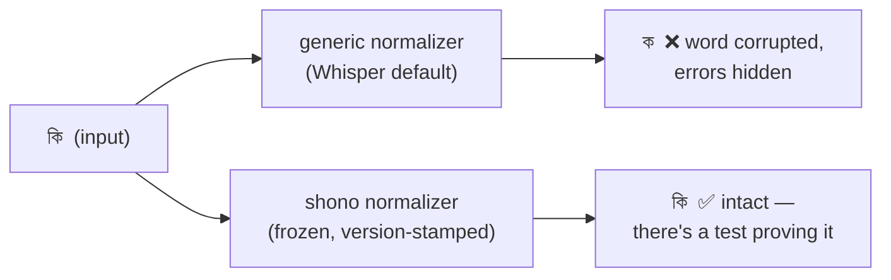
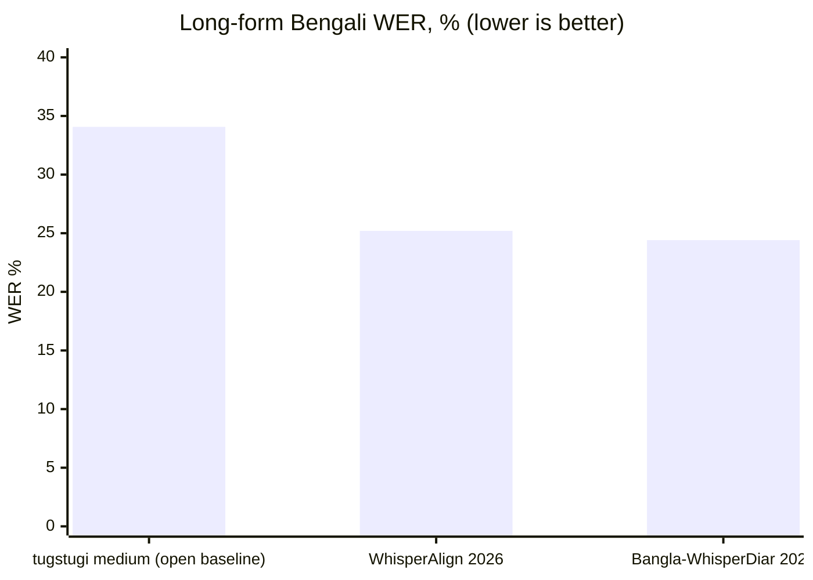
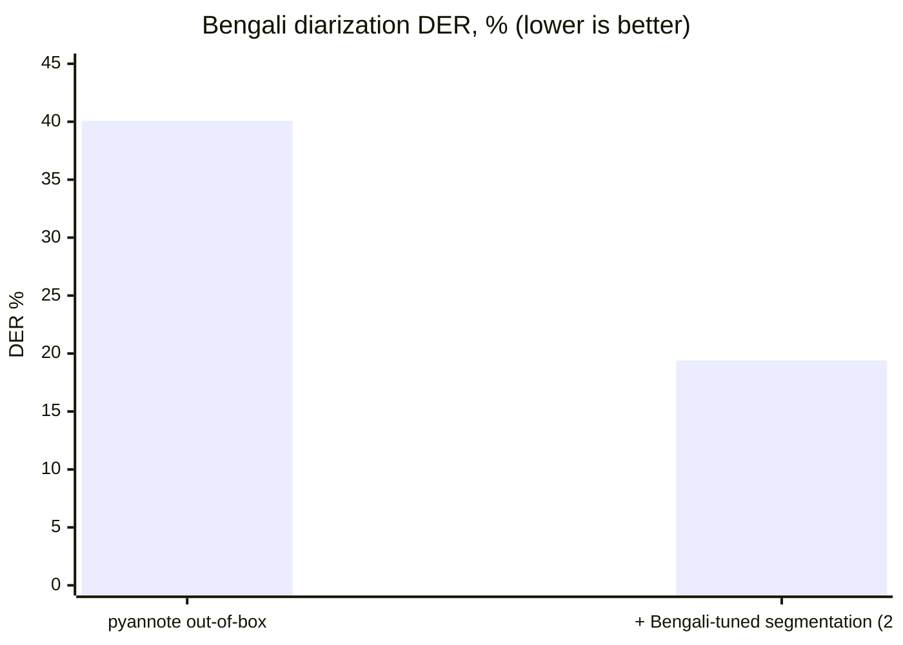
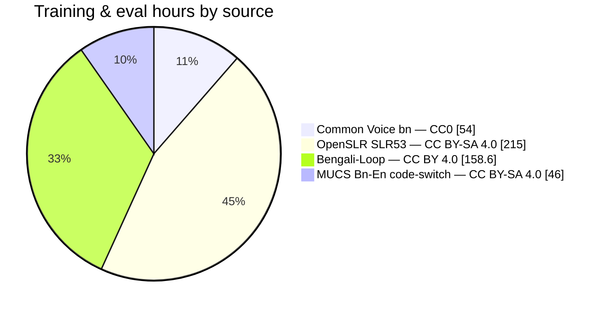
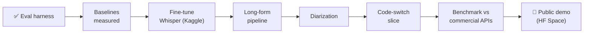

# Shono (শোনো) — Bengali ASR that survives the real world

Most Bengali speech recognition is measured on short, clean, read-aloud clips. Real audio isn't like that. **Shono** targets the hard parts:

- **Long-form audio** — lectures and podcasts, chunked, transcribed, merged, timestamped
- **Speaker diarization** — who said what, not just what was said
- **Bangla-English code-switching** — the way people actually talk
- **Honest evaluation** — WER *and* CER per segment type, with confidence intervals, against the base model and commercial APIs

> **Status: foundation.** The evaluation harness is built and tested (41 tests, one `./verify` command). No model is fine-tuned yet — **no accuracy numbers are claimed yet.** When they appear, they ship with the scoring script, config, and confidence intervals that produced them.

## The pipeline



Every number the pipeline produces passes one gate:



## Why the scorer came first

Bengali WER is easy to fake by accident — the ecosystem's most common normalizer (Whisper's default) strips vowel signs and *inflates* apparent accuracy:



Three guarantees, each pinned by tests that fail if the behavior mutates:

- **`normalize`** — matras survive; Latin code-switch tokens keep case; symbol spacing can't flip a score (`৳১০০` ≡ `৳ ১০০`)
- **`score`** — explicit raw contract, no hidden case folding; both sides always normalized together
- **`ci`** — recordings resampled, not segments (they're correlated); every number ships as `x% [lo, hi]`

## The bar to beat

Published results on the [Bengali-Loop](https://arxiv.org/abs/2602.14291) long-form benchmark — Shono's bar is added only when measured:





Sources: [Bengali-Loop](https://arxiv.org/abs/2602.14291), [WhisperAlign](https://arxiv.org/abs/2603.04809), [Bangla-WhisperDiar](https://arxiv.org/abs/2605.08214). For scale: zero-shot Whisper large-v3 sits at ~33.9% WER on Bengali FLEURS ([FLEURS-SLU](https://arxiv.org/abs/2501.06117)).

**What nobody publishes yet — where Shono aims:** a Bangla-English **code-switch slice**, an **independent per-slice comparison vs commercial APIs**, and a **usable public demo**.

## Data



Audio never enters this repo — [`data/`](data/) holds manifests, checksums, and per-source licenses only.

## Quickstart

Requires [uv](https://docs.astral.sh/uv/); Python 3.11 resolves automatically.

```bash
git clone https://github.com/urme-b/shono && cd shono
./verify        # install + lint + full test suite
```

```python
from shono.eval import score, blockwise_bootstrap_ci

report = score(references, hypotheses)      # raw + normalized WER/CER
ci = blockwise_bootstrap_ci(records)        # records = (recording_id, ref, hyp)
print(f"WER {ci.point:.1%} [{ci.lower:.1%}, {ci.upper:.1%}]")
```

```
src/shono/eval/   frozen normalization · WER/CER scoring · bootstrap CIs
tests/            fixture tests with hand-computed values
data/             dataset manifests + licenses — never audio
notebooks/        Kaggle training/benchmark notebooks
reports/          generated evaluation reports
```

## Roadmap



## License

Code: [MIT](LICENSE). Datasets and model weights carry their own licenses, recorded per source in `data/`.
